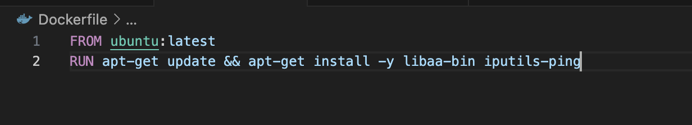
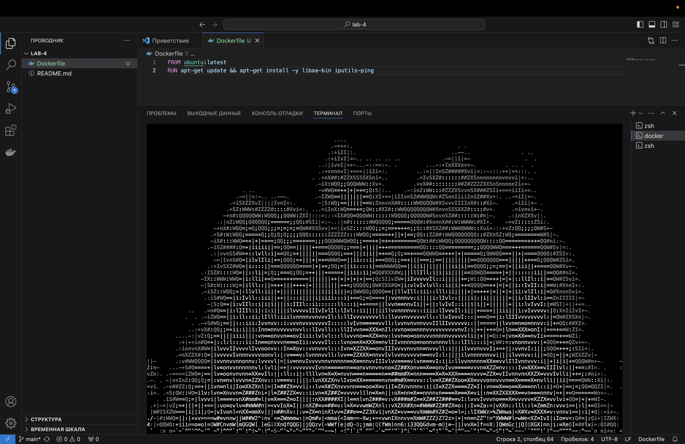
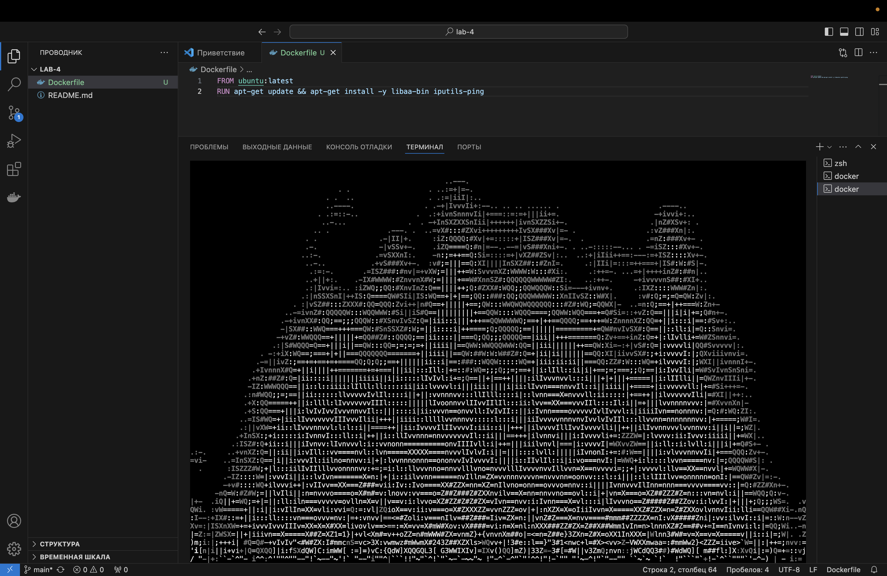
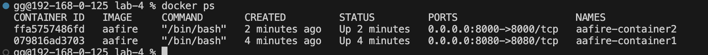
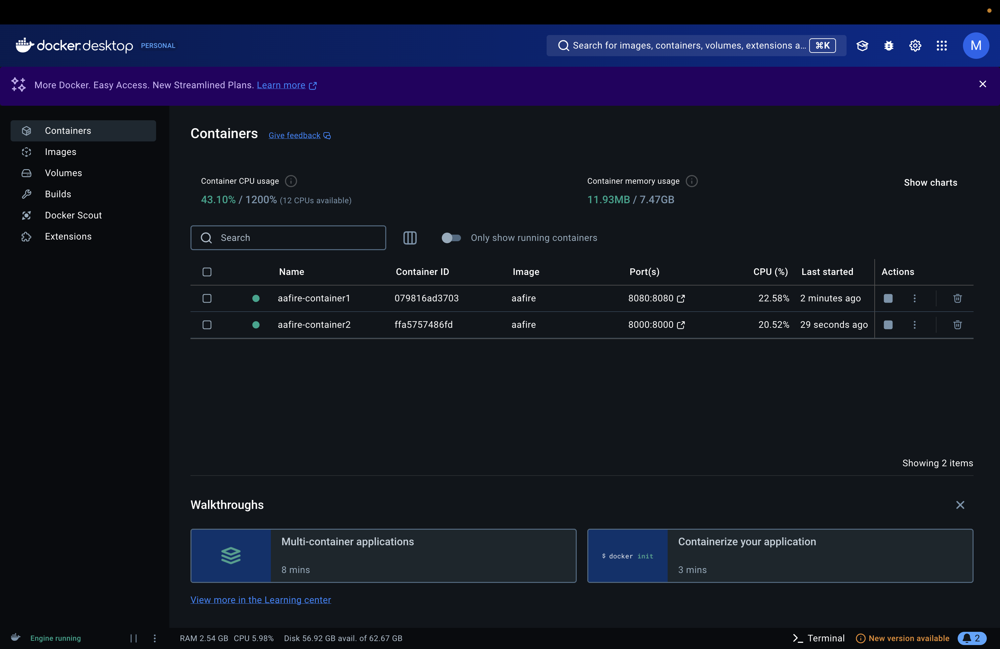
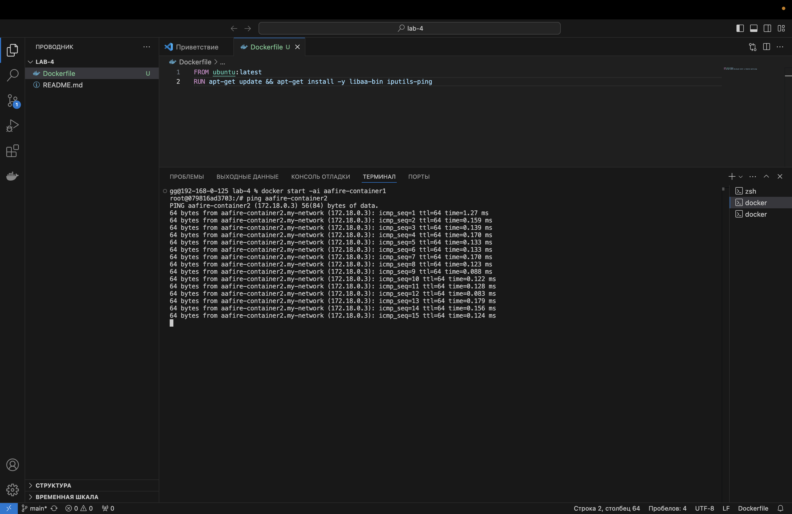
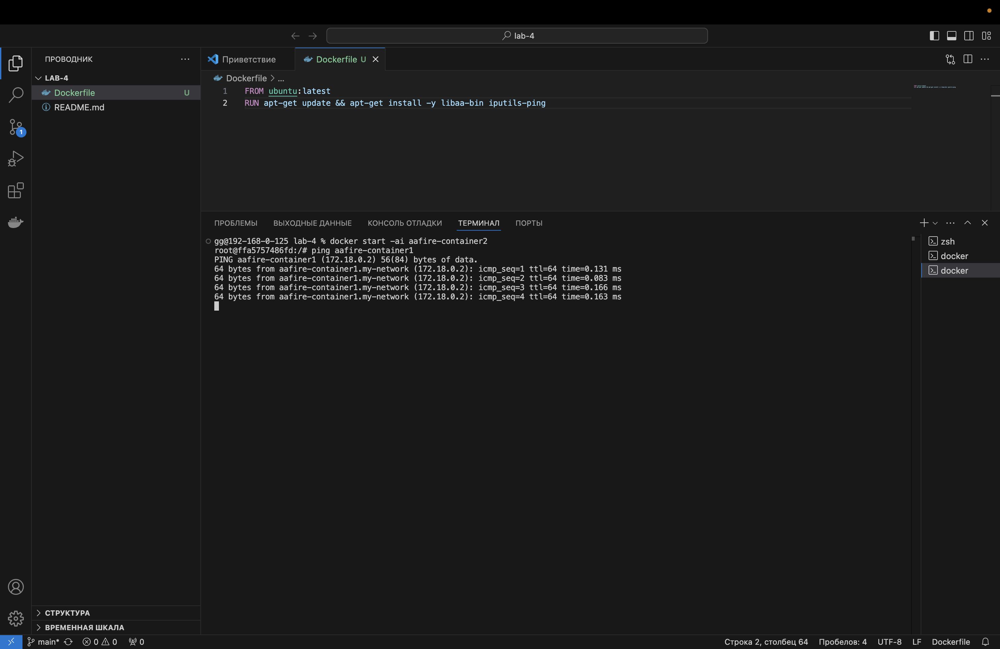

1. Сначала я скачала Docker desktop и создала в VSCode Dockerfile, а также три терминала.
2. Создала Dockerfile с содержанием, который можно видеть на скрине 1. 
3. Собрала Docker образ командой ```docker build -t aafire .```
4. Запускаем два контейнера во 2 и 3 терминалах, с помощью команд ```docker run -it --name aafire-container1 -p 8080:8080 aafire``` и ```docker run -it --name aafire-container2 -p 8000:8000 aafire``` 
5. Запускаем команду aafire в двух терминалах (скрин 2,3)
6. В целом огонек работает а это значит что все окииии 
7. Пишем ```docker ps``` и видим, что наши контейнеры появились. Потом заходим в Docker и видим, что там тоже есть контейнеры. (скрин 4,5)
8. Создаем сеть командой ```docker network create -d bridge my-network```
9. Подключаем контейнеры к сети. Для первого контейнера ```docker network connect my-network aafire-container1``` . Для второго ```docker network connect my-network aafire-container2```
10. Теперь в 2 и 3 терминале проверяем пинги, все работает ! 😂 (ping aafire-container2(во втором терминале скрин 6)/ping aafire-container(в третьем терминале скрин 7))







